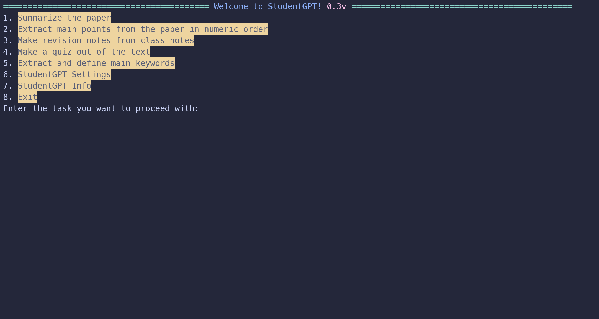

# StudentGPT

StudentGPT is a Python-based side project designed to aid students in digesting and retaining information from a variety of sources. It has the ability to summarize PDF files, including lengthy research papers, extract essential points and keywords, provide keyword definitions, create revision notes from class notes, and generate quizzes with answers based on the content of any given PDF.

## Features

- Summarize any PDF file
- Extract main points and keywords
- Provide definitions for extracted keywords
- Create revision notes from class notes
- Generate quizzes with answers based on the PDF content

## Technical Details

- Place your class notes in the 'Notes' folder
- Store the PDF files you want to process in the 'Readings' folder
- Make sure you have Python 3 installed on your machine

Before running the program, you will be prompted to enter your OpenAI API key. In simple terms, an API key is a unique code that allows the program to access and use the OpenAI service. To obtain an API key, you need to sign up for an account on the OpenAI website. All new OpenAI accounts get $5 free credit so you can use that. If it has expired or you have already used that, you will need to set up a paid account. The costs of course depends on the length of the PDF you provide but on average around 40 pages summarization costs around $0.01-$0.02 using GPT3.5 Turbo. Link for the API key: https://platform.openai.com/account/api-keys

StudentGPT uses the GPT-3.5 Turbo model instead of GPT-4 because it is more cost-effective and not many people have access to the GPT-4 API yet. However, if you wish to use the GPT-4 model, you can easily modify the code to accommodate this change.

## Get Started

1. Install Python 3 onto your machine: https://www.python.org/
2. Download the files onto your machine: https://github.com/michpcx/StudentGPT
3. Install the required dependencies by running the following command pip install -r requirements.txt
4. Run the program and enter your OpenAI API key when prompted
5. Enjoy an efficient and effective study experience with StudentGPT!
